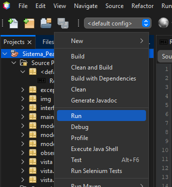

<h1> Sistema de peajes </h1>

 Proyecto obligatorio de finalización de la materia Diseño y Desarrollo de aplicaciones. 
 Este proyecto se realizó en lenguaje Java (JDK 19) con utilización de Swing para el interfaz de usuario y se aplica varios patrones de diseño.

<h2> Descripción del proyecto</h2>
    

    •Construir un prototipo para gestionar los distintos peajes que se carguen en el sistema. 
    •Panel de control para usuarios con rol Administrador y otro panel para usuarios con rol propietarios de vehículos. 
    •Existirá cálculos de bonificaciones. 
    •Se realizara una interfaz gráfica para escritorio para los distintos usuarios. 
    

<h2>Stack usado</h2>
    <ul>
        <li>Java</li>
        <li>Swing (interfaz gráfica)</li>
    </ul>

<h2> Patrones utilizados</h2>
    <ul>
        <li>Fachada</li>
        <li>División Lógica</li>
        <li>Experto</li>
        <li>Herencia</li>
        <li>Polimorfismo</li>
        <li>Interfaces</li>
        <li>Observer</li>
        <li>Excepciones</li>
        <li>MVC (modelo-vista-controlador)</li>
    </ul>

<h2>Funcionalidades</h2>
   <h3>Generales:</h3>
        
Login 

        
Salir 

     
    <h3>Propietario</h3>    
            
Solicitar recarga de saldo

           
 Borrar notificaciones del panel

    

     

<h2> Ejecución del proyecto</h2>
    
Para poder probar el proyecto, deberá descargar los archivos del repositorio, 
    tener instalado en el equipo Apache NetBeans IDE 17. 
    Ya con los archivos descargador y el IDE ejecutado, abra el proyecto dentro del IDE.  
    Seleccione la raíz del proyecto, clic derecho sobre lo seleccionado y a continuación puede ejecutarlo apretando la opción “RUN” 
    como se puede apreciar a continuación.

    

    

